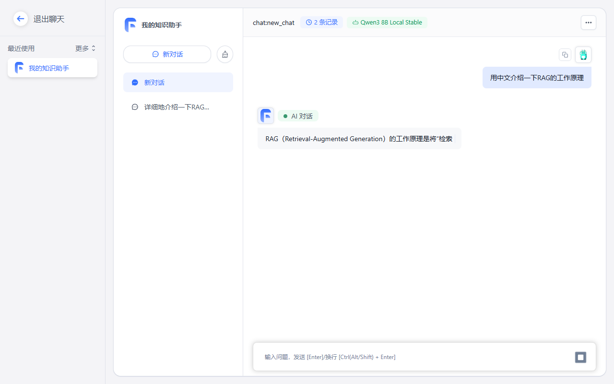
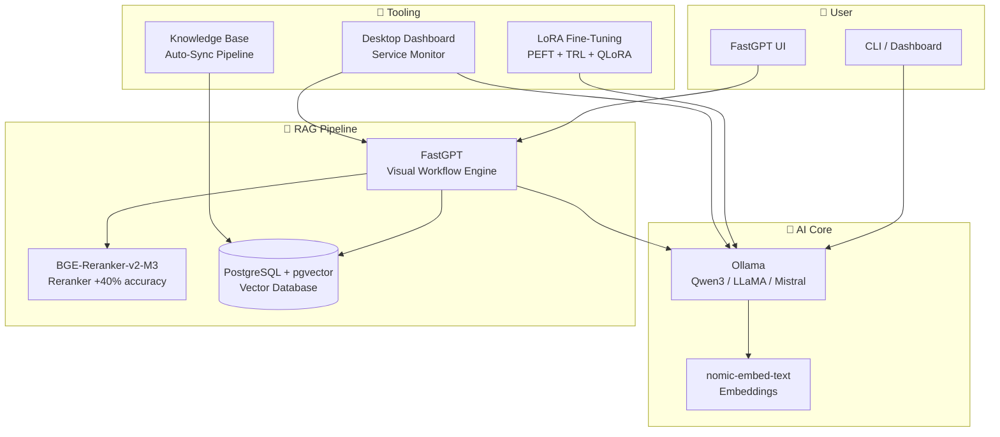

# Local AI Stack — Own Your AI Workspace
> **Private RAG, knowledge bases, coding help, and model tooling—running on your machine.**
> Ollama · FastGPT · pgvector · BGE reranking · LoRA / QLoRA
> **No usage metering. No cloud lock-in. Your data stays local.**

<p align="center">
<a href="https://github.com/caizefan34/local-ai-stack"></a> <a href="https://caizefan34.github.io/local-ai-stack/"></a> <a href="https://github.com/caizefan34/local-ai-stack/blob/master/LICENSE"></a> <a href="https://github.com/caizefan34/local-ai-stack/commits/master"></a></p>

<p align="center">
  
</p>

<p align="center">
<a href="#-quick-start"><b>Quick Start</b></a> · <a href="#-why-local-ai-stack"><b>Why Local</b></a> · <a href="#-use-cases"><b>Use Cases</b></a> · <a href="#-architecture"><b>Architecture</b></a> · <a href="https://caizefan34.github.io/local-ai-stack/"><b>Live Walkthrough</b></a> · <a href="https://github.com/caizefan34/local-ai-stack/discussions"><b>Discuss</b></a></p>

---

## Why this stack?

Most local-AI projects stop at model chat. Local AI Stack gives you a reusable workspace around it: bring in documents, build a private RAG workflow, run local models through Ollama, and optionally fine-tune a model from your own examples.

| Use it when you want to… | Included path |
|---|---|
| Ask questions over papers, notes, or a team wiki | FastGPT + pgvector knowledge base + optional BGE reranking |
| Keep code and prompts off third-party APIs | Ollama-backed local inference + OpenCode configuration |
| Keep a knowledge base fresh | Import and folder-sync tools with extraction and deduplication |
| Create a specialized assistant | Data preparation, QLoRA training, merging, and Ollama export scripts |
| Manage the local stack with a team | Authenticated Dashboard with viewer, operator, and admin roles |
| Connect an MCP client or investigate code | Local stdio MCP server and bounded read-only agent workflows |

<p align="center">
  <a href="https://caizefan34.github.io/local-ai-stack/"><b>Explore the live walkthrough →</b></a>
  &nbsp; · &nbsp;
  <a href="https://github.com/caizefan34/local-ai-stack"><b>Star the project ★</b></a>
</p>

## 🚀 Quick Start

Get your first local AI chat running in **under 5 minutes**.

### Windows

```powershell
git clone https://github.com/caizefan34/local-ai-stack.git
cd local-ai-stack
.\scripts\setup.ps1
```

Then open **http://localhost:3000**. The installer creates random local credentials and saves the admin password in `.env`.

### Linux / WSL (one command)

```bash
git clone https://github.com/caizefan34/local-ai-stack.git
cd local-ai-stack
bash scripts/setup.sh
```

> ✅ **Prerequisites:** Windows: [Docker Desktop](https://docs.docker.com/desktop/setup/install/windows-install/) · Linux: Docker + docker compose plugin · Python 3 · 8 GB RAM

> 🔐 **Credentials:** `scripts/setup.sh` / `scripts/setup.ps1` creates a local `.env` with random credentials. If starting Compose manually, copy `.env.example` to `.env` and replace both placeholder values first.

> 💻 **Code mode:** add `-CodeMode` on Windows or `--code-mode` on Linux/WSL to pull Qwen2.5-Coder 7B (generation) and 1.5B (inline completion). See the [code intelligence guide](docs/code-intelligence.md).

> 🛡️ **Authenticated Dashboard:** create the first administrator with `python -m control_plane bootstrap-admin --username admin`, then run `python -m control_plane serve` and open [http://127.0.0.1:18080](http://127.0.0.1:18080). See the [access-control guide](docs/multi-user-access.md) and [model manager](docs/model-manager.md).

<p align="center">
<a href="https://caizefan34.github.io/local-ai-stack/" style="display:inline-block;padding:10px 28px;border-radius:8px;background:linear-gradient(135deg,#6366f1,#4f46e5);color:#fff;font-size:16px;font-weight:600;text-decoration:none">▶ Explore the walkthrough</a>
<a href="https://github.com/caizefan34/local-ai-stack" style="display:inline-block;padding:10px 28px;border-radius:8px;background:#1a1a2e;color:#fff;font-size:16px;font-weight:600;text-decoration:none;margin-left:8px">⭐ Star on GitHub</a>
</p>

---

## ✨ Features

<table>
<tr><td width="50%"><h3>🔒 Privacy First</h3><p>All data is processed locally after setup. Your documents remain on your machine.</p></td>
<td width="50%"><h3>🎹 Practical RAG</h3><p>Visual workflows with FastGPT, pgvector search, and an optional BGE-Reranker-v2-M3 service.</p></td></tr>
<tr><td><h3>💪 LoRA Fine-Tuning</h3><p>PEFT + TRL pipeline. Fine-tune Qwen3-8B on 8GB VRAM with QLoRA. Turn your conversations into a custom model.</p></td>
<td><h3>🔄 Auto-Sync Pipeline</h3><p>Weekly sync from Windows folders to FastGPT. Import papers, courses, and GitHub repos automatically.</p></td></tr>
<tr><td><h3>💻 Authenticated Dashboard</h3><p>Responsive service monitor with role-gated controls, user management, KB sync, and allowlisted model downloads.</p></td>
<td><h3>🌐 Multi-Model</h3><p>Switch between Qwen3, LLaMA, Mistral via config. 4 models pre-configured for different workloads.</p></td></tr>
<tr><td><h3>🔌 MCP Server</h3><p>Connect MCP-compatible clients over local stdio for model, generation, reranking, and health tools.</p></td>
<td><h3>🤖 Bounded Agent Workflows</h3><p>Use explicit, step-limited, read-only investigation workflows for workspace and code diagnosis.</p></td></tr>
</table>

### Operations and integrations

- [Control-plane access and roles](docs/multi-user-access.md) — secure dashboard setup and remote-access guidance.
- [One-click model manager](docs/model-manager.md) — role-gated Ollama model downloads from an allowlist.
- [MCP server](mcp_server/README.md) — start and configure a local stdio MCP integration.
- [Agent workflows](docs/agent-workflows.md) — run bounded, read-only multi-step investigation.

---

## 💡 Why Local AI Stack?

Most RAG solutions leave you compromising on something:

| Pain Point | The Problem | How This Stack Solves It |
|------------|-------------|--------------------------|
| **OpenAI costs** | Pay per token, rate limits, unpredictable bills | **100% free** — no API keys, no usage charges |
| **Privacy concerns** | Your documents shipped to cloud servers | **100% offline** — everything runs on your machine |
| **Cloud dependency** | Can't work without internet | **Works offline** — no internet needed after setup |
| **GPU requirements** | Need expensive NVIDIA GPUs | **Runs on CPU** — 8 GB RAM is enough (GPU optional) |
| **Complex deployments** | Kubernetes, multiple YAML files, days of config | **One command** — `docker compose up` or `bash setup.sh` |

This stack gives you a **production-grade RAG system** that's fully local, fully private, and completely free — running on hardware you already own.

## 🎬 Demo

### Service Dashboard
Monitor all services in real time:

```
⚫ ollama    ✔️ online     FastGPT:  http://localhost:3000
⚫ fastgpt   ✔️ online     Reranker: http://localhost:18888
⚫ reranker  ✔️ online     Ollama:   http://localhost:11434
⚫ docker    ✔️ running
```

Start the authenticated Dashboard control plane, then open **http://127.0.0.1:18080**:
```powershell
python -m control_plane bootstrap-admin --username admin
python -m control_plane serve
```

The first command is needed only once. The Dashboard requires sign-in; see the [access-control guide](docs/multi-user-access.md) for roles and remote-access guidance.

## 📈 Use Cases

| Scenario | How This Helps |
|----------|---------------|
| 🎓 **Research Papers** | Import PDFs, auto-extract metadata, search with reranker-enhanced RAG |
| 📚 **Course Notes** | Sync folders, chunk documents, query your notes with natural language |
| 👥 **Team Wiki** | Self-hosted knowledge base for your team — no cloud dependency |
| 💻 **Coding Assistant** | Pre-configured local AI coding assistant (OpenCode) for private code Q&A |
| 🧠 **Personal Knowledge Base** | Weekly auto-sync from your folders to FastGPT — never lose context |
| 🤖 **AI Agent Memory** | Use RAG as long-term memory for AI agents, with vector search |
| 🎯 **Model Fine-Tuning** | Collect Q&A logs, train LoRA adapters, deploy custom models via QLoRA |

---

## 📊 Comparison

| Feature | **Local AI Stack** | Open WebUI | AnythingLLM | Dify | RagFlow |
|---------|:---:|:---:|:---:|:---:|:---:|
| **100% Local** | ✅ | ✅ | ✅ | ❌ Cloud | ❌ Cloud |
| **RAG** | ✅ | ✅ | ✅ | ✅ | ✅ |
| **Fine-Tuning** | ✅ LoRA/QLoRA | ❌ | ❌ | ❌ | ❌ |
| **Knowledge Base** | ✅ Auto-sync | ❌ | ✅ | ✅ | ✅ |
| **CPU Only** | ✅ 8 GB RAM | ✅ | ✅ | ❌ Needs GPU | ❌ Needs GPU |
| **One-Command Setup** | ✅ `setup.sh` | ⚠️ Manual | ⚠️ Manual | ❌ Complex | ❌ Complex |
| **Built-in Reranker** | ✅ BGE-Reranker-v2-M3 | ❌ | ❌ | ❌ | ❌ |
| **Desktop Dashboard** | ✅ | ❌ | ❌ | ❌ | ❌ |
| **Offline** | ✅ Full | ✅ | ✅ | ❌ | ❌ |

> Comparisons are based on publicly available information as of July 2026. Features may change.

---

## 🧩 Architecture



## 🗺️ Project Structure

```text
local-ai-stack/
├── config/          ← FastGPT & OpenCode configs
├── docker/          ← Docker Compose (with resource limits)
├── docs/            ← Documentation & GitHub Pages
├── knowledge-base/  ← Import tools + auto-sync pipeline
├── lora-finetune/   ← LoRA training pipeline (collect, train, export)
├── models/          ← Ollama Modelfiles
├── reranker/        ← BGE Reranker FastAPI service
├── scripts/         ← Setup, start, automation scripts
├── desktop-app/     ← Dashboard (HTML) + API server
├── tests/           ← E2E tests & model evaluation
└── .github/         ← CI/CD workflows
```

---

## 🛣️ Roadmap

- [x] Local RAG with FastGPT
- [x] Ollama integration (Qwen3, LLaMA, Mistral)
- [x] LoRA / QLoRA fine-tuning pipeline
- [x] BGE Reranker for improved accuracy
- [x] Knowledge base auto-sync pipeline
- [x] Desktop service dashboard
- [x] GitHub Pages documentation site
- [x] MCP (Model Context Protocol) support — local stdio server in [`mcp_server/`](mcp_server/README.md)
- [x] Agent workflows and multi-step reasoning — bounded read-only workflows in [`agent_workflows/`](docs/agent-workflows.md)
- [x] Multi-user support and access control — authenticated local control plane with viewer, operator, and admin roles
- [x] Mobile-friendly dashboard — responsive authenticated control plane UI
- [x] One-click model download manager — allowlisted background Ollama downloads in the authenticated Dashboard

---

## ❓ FAQ

### Do I need a GPU?
**No.** The stack runs entirely on CPU with 8 GB RAM. A GPU will speed up inference and training, but it's optional.

### Can I run offline?
**Yes.** After the initial model download, everything runs locally with no internet connection required.

### Which models are supported?
Any model supported by Ollama works. Pre-configured: Qwen3-8B (default), LLaMA 3, Mistral, and nomic-embed-text for embeddings.

### Can I use my own documents?
**Yes.** Import PDFs, text files, Markdown, or sync entire folders. The auto-sync pipeline indexes them automatically.

### How much RAM is required?
**8 GB minimum** for Qwen3-8B with RAG. 16 GB recommended for running multiple services simultaneously.

### Do you store my data?
**Never.** All data stays on your local machine. There are no telemetry, analytics, or cloud sync features.

---


## 🔧 Troubleshooting

### Docker Compose fails with "healthcheck" errors
If you see `service "pg" refers to undefined build source` or healthcheck syntax errors, ensure you're using Docker Compose v2.22+:
```bash
docker compose version
# Upgrade: https://docs.docker.com/compose/install/
```

### FastGPT shows "Network Error" or won't load
The stack needs all three databases healthy before FastGPT starts:
```bash
docker compose --env-file .env -f docker/docker-compose.yml ps
# Wait for pg, mongo, redis to show "healthy", then:
docker compose --env-file .env -f docker/docker-compose.yml restart fastgpt
```

### Ollama models not found by FastGPT
Make sure Ollama is running **outside** Docker (host install). FastGPT connects via `host.docker.internal`:
```bash
ollama list                          # Verify models exist
curl http://localhost:11434/api/tags # Verify Ollama API
```

### Reranker service won't start
The BGE model downloads on first run (~2 GB). Ensure enough disk space and internet:
```bash
# Check logs
cat reranker/service.log
# Manual start for debugging
cd reranker && python server.py
```

### Port conflicts
If port 3000, 5432, or 27017 is already in use, edit your `.env` file:
```env
FASTGPT_PORT=3001
PG_HOST_PORT=5433
MONGO_HOST_PORT=27018
```
Then restart: `docker compose --env-file .env -f docker/docker-compose.yml up -d`

### "Permission denied" on Linux for the config mount
```bash
sudo chown 1000:1000 config/fastgpt-config.json
# Or set world-readable: chmod 644 config/fastgpt-config.json
```

### Models download slowly
- Model sizes: Qwen3-8B (~4.7 GB), nomic-embed-text (~274 MB)
- Use the interactive model downloader: `bash scripts/pull-models.sh`
- Models are cached locally after first download

### Still stuck?
- [Search existing issues](https://github.com/caizefan34/local-ai-stack/issues)
- [Start a discussion](https://github.com/caizefan34/local-ai-stack/discussions)
- Run `bash scripts/setup.sh` (Linux) or `.\scripts\setup.ps1` (Windows) for a fresh start

## 🤝 Community

- 💬 [Join the Discussion](https://github.com/caizefan34/local-ai-stack/discussions) — ask questions, share setups
- 🐛 [Report an Issue](https://github.com/caizefan34/local-ai-stack/issues) — bug reports and feature requests
- 📖 [Read the Docs](https://caizefan34.github.io/local-ai-stack/) — detailed setup guide and reference

## 👥 Contributing

Contributions are welcome! Check out our [CONTRIBUTING.md](CONTRIBUTING.md) for guidelines.

---

## 📜 License

MIT License © 2026 [caizefan34](https://github.com/caizefan34). Free to use, modify, and distribute.

<p align="center">
Made with ❤️ for the open-source community.
</p>

---

## 🌟 Star the Project

<p align="center">
<a href="https://github.com/caizefan34/local-ai-stack" class="star-btn" style="display:inline-block;padding:14px 40px;border-radius:12px;background:linear-gradient(135deg,#6366f1,#4f46e5);color:#fff;font-size:18px;font-weight:700;text-decoration:none;box-shadow:0 4px 20px rgba(99,102,241,.25)">⭐ Star on GitHub</a>
</p>

<p align="center">Questions? <a href="https://github.com/caizefan34/local-ai-stack/discussions">Join the discussion</a> . <a href="https://github.com/caizefan34/local-ai-stack/issues">Report an issue</a></p>

---
> **Local AI Stack** — Production-grade Local AI Workspace. 100% private. 100% free. No GPU required.

